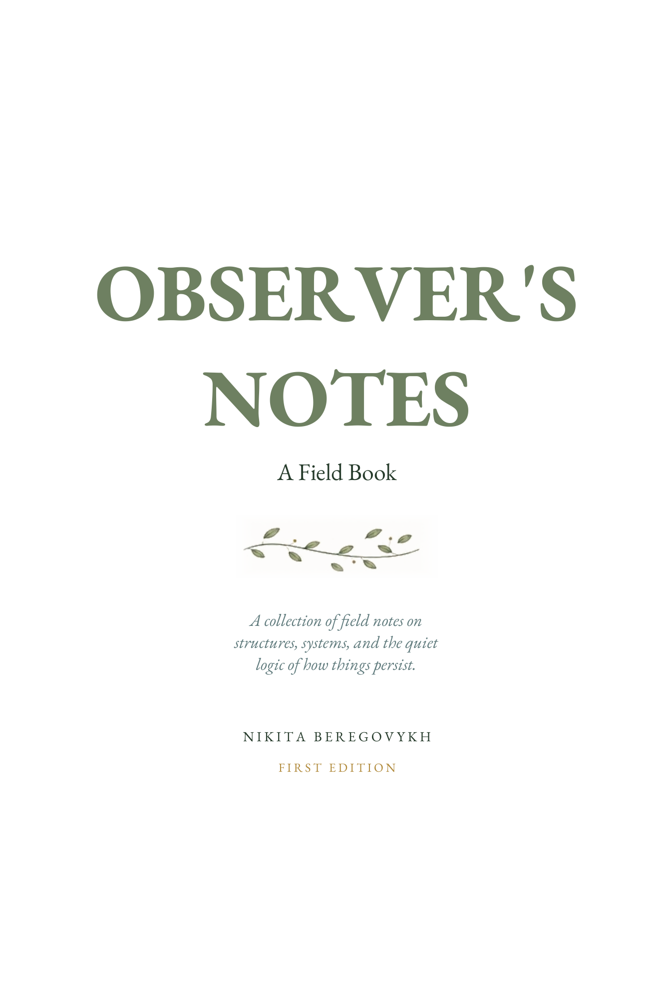
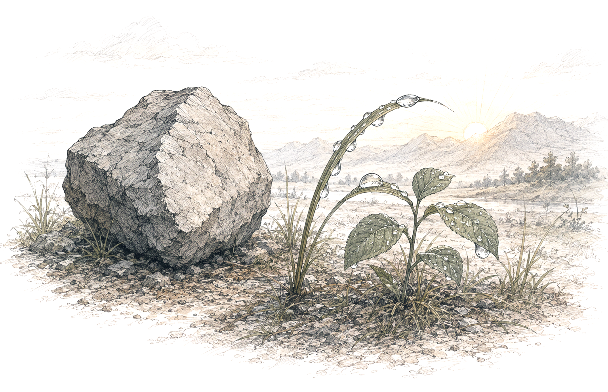
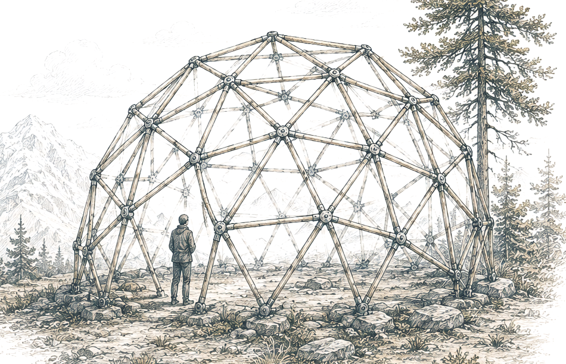
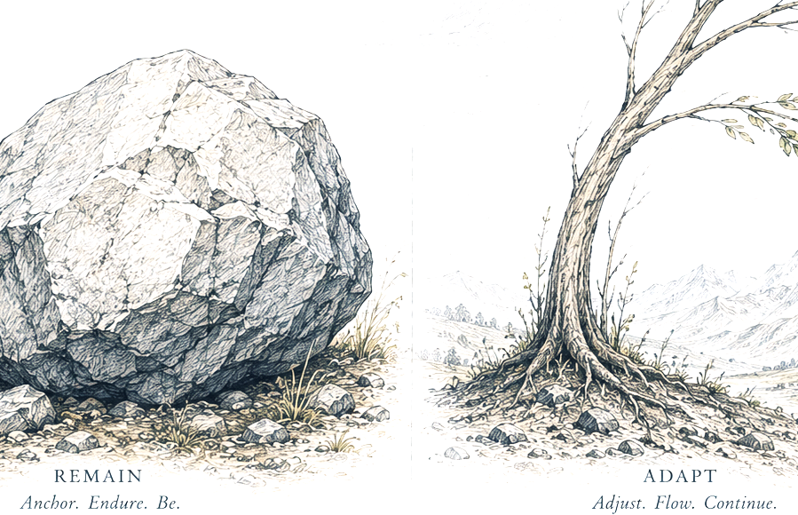
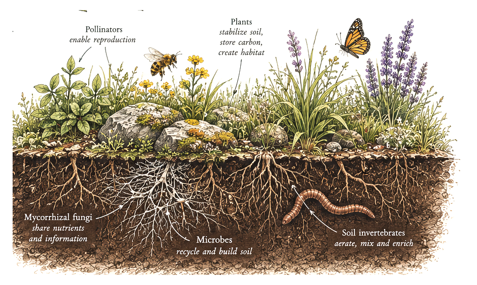
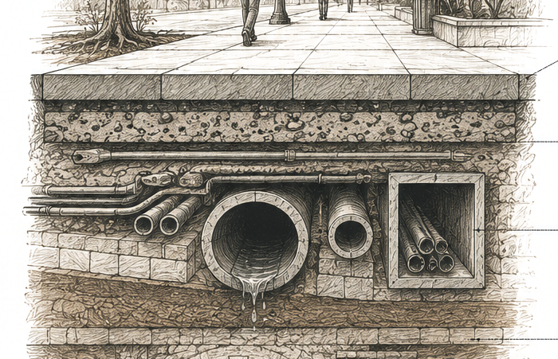
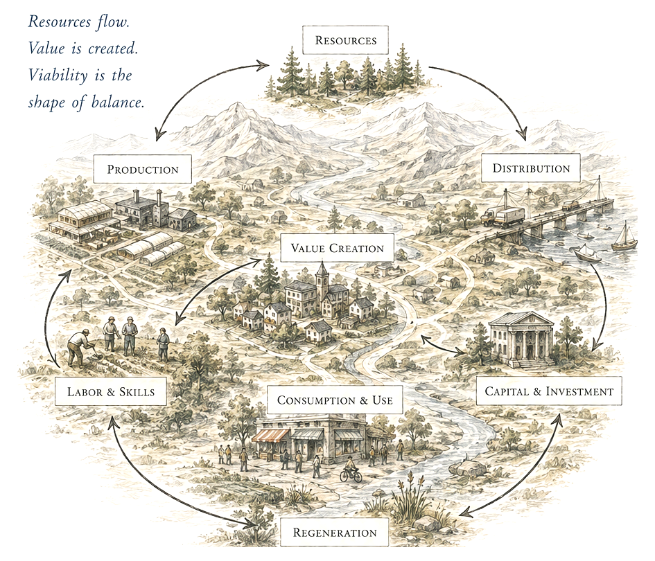
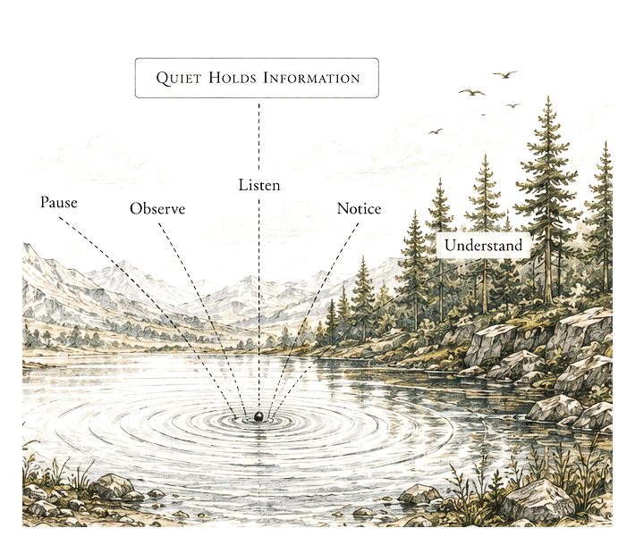
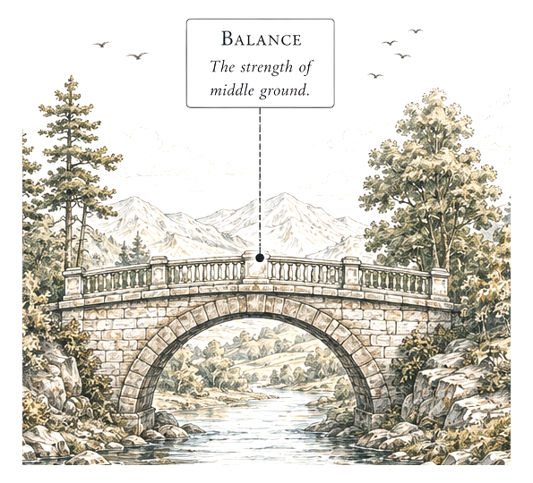
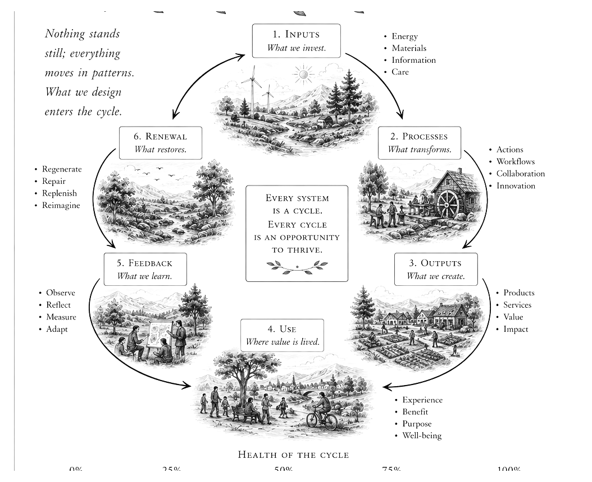

<h1 align="center">Observer's Notes</h1>

<em>A Field Book</em>

  <strong><a href="./Observers_Notes.pdf">Download the illustrated PDF edition</a></strong>
  &nbsp;·&nbsp;
  <a href="#contents">Read by note</a>
  &nbsp;·&nbsp;
  <a href="#the-model-in-one-walk">Model recap</a>
  &nbsp;·&nbsp;
  <a href="#a-page-for-localization">Localization sheet</a>

---

## Publication note

Copyright © 2026 Nikita Beregovykh. This edition is prepared as a public
discussion draft. The conceptual model may be shared and discussed with
attribution.

This book is a philosophical field guide. It is not a new law of
physics, a replacement for established science, or a proof of moral
duty. Scientific claims are kept within their ordinary domains. The
broader architecture is interpretive.

· ❦ ·

> *The book grew from a simple observation: a higher structure does not
> leave its foundations behind. It continues to depend on them.
> Sometimes it also learns to care for them.*

## A note before walking

*This is not a manifesto. It is not a technical specification wearing a
philosophical coat. It is a set of notes made while looking at ordinary
things: a stone, a leaf, a wall, a cell, a street, a machine, and the
people who keep all of them working.*

The model is simple. Elements interact. Interactions realize relations.
Relations form structures. Some structures remain within a range in
which they can still be recognized as the same system. Some structures
also regulate that range. Higher structures depend on lower structures.
A few higher structures can model those dependencies and intervene in
them.

The words will be defined when they become useful. The definitions are
not decorations. They are handles. Each one should let the reader hold a
part of the model without holding the entire book in memory.

The garden form is intentional. A garden is not a metaphor pasted onto
the theory. It is a compact example of the theory. Soil, water, roots,
insects, fungi, leaves, weather, tools, walls, and people form several
levels of dependency. Some processes happen without a gardener. Some
require maintenance. Some maintenance changes the conditions for later
growth.

The same model can be localized in a cell, a building, an economy, an
institution, or a technological system. The details change. The
questions remain recognizable: What is the system? What makes it the
same system over time? What does it require? What keeps those
requirements available? What can fail first?

The operational pages are local templates, not universal laws. Each
should be checked against observations and against at least one
materially different measurement or modeling method applied to the same
cases. Agreement supports robustness. Disagreement identifies
assumptions, scale choices, or omitted variables; it should not be
hidden by averaging. The final question is left open. The book is meant
to make it easier to ask well.

## Contents

| Ref | Note | PDF page |
|:---:|---|:---:|
| N1 | [The Stone and the Dew](#n1) | 4 |
| N2 | [What Exists Between Things](#n2) | 9 |
| N3 | [A Structure Is Not a Pile](#n3) | 14 |
| N4 | [The Boundary of the Same Thing](#n4) | 19 |
| N5 | [Two Ways to Persist](#n5) | 24 |
| N6 | [Roots Beneath Roots](#n6) | 29 |
| N7 | [The Garden That Maintains Its Gardener](#n7) | 34 |
| N8 | [Time Gives Structure Room](#n8) | 39 |
| N9 | [Small Systems, Large Consequences](#n9) | 44 |
| N10 | [The City Under the Pavement](#n10) | 49 |
| N11 | [The Economy as a Viability Map](#n11) | 54 |
| N12 | [The Observer Inside the Instrument](#n12) | 59 |
| N13 | [When to Touch the System](#n13) | 64 |
| N14 | [The Open Gate](#n14) | 69 |

> Use **N1-N14** for stable model references. Use the PDF page numbers for fixed-layout citations.

## N1 · The Stone and the Dew

*Begin with things before giving them meaning*

### Observation

*At dawn the stone beside the path looks inactive. Dew sits on its upper
face. The stone does not repair itself. It does not search for water. It
does not choose a direction. Yet it is not outside physical activity.
Its atoms remain bound. Its surface exchanges heat. Water adheres to it.
Light changes the state of the water and the air around it.*

The first mistake is to divide the world into living things that act and
dead things that do nothing. The difference is too rough. A crystal, a
molecule, and a steel beam participate in relations. They constrain what
nearby states are possible. They can transmit force. They can store
stress. They can make a later event different from what it would have
been without them.

For this book, an element is any distinguishable entity selected for
analysis. The word does not tell us what the entity is in itself. It
tells us what role it has in the model. A particle can be an element. So
can a molecule, a cell, a pump, a person, a law, or a company. The
choice depends on scale and purpose.

A state is the set of values used to describe an element or system at a
time. Temperature may matter for the stone. Position may matter for a
moving tool. Voltage may matter for a circuit. Trust may matter in an
institution, although it is harder to measure. A state description is
never the whole object. It is the part of the object needed for the
present question.

· ❦ ·

An interaction is a realized process through which one state changes or
constrains another possible state. The word realized matters. A possible
collision is not a collision. A possible conversation is not a
conversation. A possible dependency does not yet carry anything. The
model begins when something actually enters the history of something
else.

This is the working meaning of active existence: causal participation in
at least one realized relation that changes or constrains the possible
evolution of a selected system during a stated interval. Activity does
not require visible motion. A bond can be active because it restricts
possible states. A wall can be active because it redirects wind, heat,
people, and water. A rule can be active because it changes which actions
are available.

The phrase potential existence will be used only as an analytical limit.
It describes an entity considered apart from realized relations. It is
not a standard physical condition in which ordinary matter remains
unchanged after every interaction has been removed. The limit is useful
because it isolates the point at which a model gains history: when
elements begin to make a difference to one another.

The dew disappears after sunrise. The stone remains. One relation ended.
Others continue. Nothing mystical happened. The scene only gives us the
first three pieces: an element, a state, and an interaction.

### Field note

> *The first warmth arrives. One drop enters the soil. Nothing chooses; the scene still changes.*

**What to carry forward**

- An element is selected, not discovered as the only possible unit.

- A state description is built for a question.

- An interaction must be physically or causally realized.

- Active does not mean alive, fast, or conscious.

### Operational model

*A measurable local template, not a universal law.*

<table>
<colgroup>
<col style="width: 100%" />
</colgroup>
<thead>
<tr class="header">
<th>

<em>An element is active in the chosen interval when at least one
measured state change or interaction magnitude—including a sustained
constraint—exceeds a declared threshold.</em>
</th>
</tr>
</thead>
<tbody>
</tbody>
</table>

#### Measurements

| **Symbol** | **Operational definition and units**                                                                         |
|------------|--------------------------------------------------------------------------------------------------------------|
| Δt         | observation interval \[s, min, h\]                                                                           |
| Δx(i,k)    | change in state variable k of element i \[native units\]                                                     |
| ε(k)       | minimum meaningful or detectable change \[same units as x_k\]                                                |
| u(i,m)     | measured interaction magnitude through channel m, including transfer or sustained constraint \[domain unit\] |
| u_min(m)   | minimum meaningful or detectable interaction magnitude \[same unit as u_im\]                                 |

#### How to use it

1.  Select the element, interval, state variables, and interaction
    channels before observing.

2.  Declare thresholds from sensor resolution or practical significance.

3.  Record whether any state change, transfer, or sustained constraint
    crosses its threshold.

<table>
<colgroup>
<col style="width: 50%" />
<col style="width: 50%" />
</colgroup>
<thead>
<tr class="header">
<th>
<strong>Working example.</strong> Stone surface temperature rises
0.8 °C in 10 min; ε_T = 0.2 °C. 0.8/0.2 = 4, so A_i = 1 for that
interval.

<strong>Limit.</strong> <em>Failure to cross a threshold does not
prove causal isolation; unmeasured or subthreshold constraints may
remain.</em>
</th>
<th></th>
</tr>
<tr class="odd">
<th>
<strong>READ THE RESULT</strong>

A_i=1 reports at least one resolved interaction in the stated
interval. A_i=0 means only that none crossed the selected
thresholds.
</th>
<th>
<strong>VALIDATE IT</strong>

Repeat with a different sensor or constraint-based model on the same
interval; inspect sensitivity to variables, thresholds, and
method.
</th>
</tr>
</thead>
<tbody>
</tbody>
</table>

## N2 · What Exists Between Things

*Relations are not empty space between objects*

### Observation

*Two stones can be listed without describing a structure. Put one above
the other and the relation changes. Join them with mortar and the
relation changes again. Place them on opposite sides of an arch and the
load path becomes part of the description. The material may be similar.
The system is not.*

A relation is a coupling, constraint, dependency, correlation, bond, or
organization pattern realized through one or more interactions. The
definition is broad because relations differ by domain. A chemical bond
is not a legal obligation. A pressure difference is not a friendship.
The model does not erase those differences. It gives them a common
position in an architecture.

Relations matter because they reduce the space of possible states. A
hinge permits some motion and blocks other motion. A membrane permits
some transport and blocks other transport. A price connects decisions
that occur far apart. A language lets one nervous system change the
future state of another. Each relation opens some possibilities and
closes others.

The easiest way to lose clarity is to talk about objects as if their
list were the system. A box of parts is not a machine. A directory of
employees is not a company. A genome is not an organism. Soil, seeds,
and water do not yet make a garden. The arrangement, timing,
constraints, and flows are part of what exists.

· ❦ ·

This does not force the philosophical claim that objects are nothing but
relations. The book needs only a smaller statement: a physical or
organized structure cannot be described by enumeration alone. The
relations among selected elements are constitutive of the structure
being modeled.

The same elements can support several structures. A room can be a
classroom, a shelter, a market, or a storage space. The walls are not
enough to determine which one exists. The active relations include use,
access, rules, tools, expectations, and time. Change those relations and
the same materials may support a different system.

Relations also carry history. A scar is a current structure that records
an earlier process. A worn path records repeated movement. A database
records choices. A seed contains organization inherited from prior life.
History is not a separate substance. It survives when present relations
constrain future states in ways produced by earlier events.

The observer should therefore ask a question that sounds almost
childish: what is connected to what, and how does the connection make a
difference? The question is simple enough to be useful in a laboratory,
a construction drawing, a family, or an economy. It replaces vague talk
about complexity with a map.

### Field note

> *The bridge is not the timber alone. Wind tests the cables; the first crossing turns geometry into use.*

**What to carry forward**

- List components, then draw the relations.

- Ask which relations are constitutive and which are incidental.

- A relation is active when it changes or constrains possible evolution.

- History survives as a present constraint, record, or organization.

### Operational model

*A measurable local template, not a universal law.*

<table>
<colgroup>
<col style="width: 100%" />
</colgroup>
<thead>
<tr class="header">
<th>

<em>Coupling strength combines interaction frequency with the typical
normalized response of j after interaction with i.</em>
</th>
</tr>
</thead>
<tbody>
</tbody>
</table>

#### Measurements

| **Symbol** | **Operational definition and units**                                   |
|------------|------------------------------------------------------------------------|
| n(i,j)     | count of realized i→j interaction events                               |
| Δt         | observation interval \[time\]                                          |
| Δy(j)      | response of j after an event \[native units\]                          |
| σ(j)       | baseline standard deviation or declared practical scale \[same units\] |
| S(i,j)     | coupling rate \[events per time\] × dimensionless effect               |

#### How to use it

4.  Define an event and a response window.

5.  Count events and measure the paired response.

6.  Compare S_ij across conditions using the same interval and scale.

<table>
<colgroup>
<col style="width: 50%" />
<col style="width: 50%" />
</colgroup>
<thead>
<tr class="header">
<th>
<strong>Working example.</strong> 12 load events occur in 60 min.
Median normalized deflection is 0.25. S_ij = (12/60)×0.25 = 0.05
min⁻¹.

<strong>Limit.</strong> <em>Association is not automatically
causation; use controls or interventions when causal direction
matters.</em>
</th>
<th></th>
</tr>
<tr class="odd">
<th>
<strong>READ THE RESULT</strong>

Larger S_ij means more frequent and/or stronger realized influence
under the same sampling rule.
</th>
<th>
<strong>VALIDATE IT</strong>

Compare the event-response estimate with an intervention, lagged
process model, or another causal method on the same cases; investigate
disagreement rather than averaging it.
</th>
</tr>
</thead>
<tbody>
</tbody>
</table>

## N3 · A Structure Is Not a Pile

*Identity requires a pattern and a tolerance*

### Observation

*A fallen branch and a wooden chair may contain similar material. The
difference is not the species of wood. The chair preserves a geometry, a
load path, and a use. Those relations allow the object to remain
identifiable across small changes.*

A structure is a selected set of elements and realized relations that
remains identifiable across a stated interval and scale. The word
selected prevents a common error. No structure includes every fact about
itself. A bridge model may include geometry, material strength,
supports, loads, and temperature. It may ignore paint color. A
biological model may do the reverse.

To say that a structure remains the same requires invariants and
tolerances. An invariant is a property we choose to preserve for the
analysis. A tolerance is the acceptable range of variation. Without
them, the word same is ambiguous. A repaired ship can be the same ship
by function and legal identity while containing different planks. A cell
can remain the same cell while replacing much of its material.

This is why structure should be separated from substance. Some
structures preserve material and change relations. Others preserve
relations while replacing material. A melody survives across
instruments. A program survives across hardware. A city survives the
replacement of buildings, pipes, and people, although not every
replacement preserves the city equally well.

· ❦ ·

The model does not decide identity for us. It forces us to state the
rule. What must remain within tolerance for this system to count as this
system? Geometry? Function? Composition? Control organization? Memory?
Legal continuity? The answer changes the boundary of failure. Some
relations are critical: if one crosses its failure boundary, the
structure fails under the selected definition even when an average score
remains high.

When constitutive relations disappear, the modeled structure disappears
under that definition. The elements may remain. A collapsed arch remains
stone. A dead cell remains material. A dissolved institution leaves
records, buildings, and people. The previous organization is gone even
when much of its substance is still present.

This principle is useful because it prevents magical language about
emergence. A higher structure is not a new substance placed on top of
lower ones. It is a new pattern of relations with new invariants,
tolerances, and effects. The lower elements do not vanish. They become
organized in a way that constrains their behavior and creates a larger
unit of analysis.

A pile becomes a structure when the relations matter. A structure
becomes an organized system when processes coordinate those relations
across time. The line is not universal. It depends on the model. But
once the line is stated, the consequences can be tested.

### Field note

> *A pile accumulates. A structure distributes force and preserves a pattern.*

**What to carry forward**

- Define the structure by what must remain recognizable.

- State the scale and interval.

- State the invariants.

- State the tolerances and any critical relations.

- Do not confuse remaining material with remaining organization.

### Operational model

*A measurable local template, not a universal law.*

<table>
<colgroup>
<col style="width: 100%" />
</colgroup>
<thead>
<tr class="header">
<th>

<em>Integrity combines distributed deviation with a critical-relation
veto; report the worst deviation separately from the weighted
index.</em>
</th>
</tr>
</thead>
<tbody>
</tbody>
</table>

#### Measurements

| **Symbol**  | **Operational definition and units**                                   |
|-------------|------------------------------------------------------------------------|
| r(t), r\*   | current and reference values of constitutive relation r                |
| τ(r)        | allowed deviation for relation r before boundary crossing              |
| d(r), D_max | normalized deviation \|r(t)−r\*\|/τ(r); maximum across all relations   |
| w(r), C     | measured load/flow weight; set of non-substitutable critical relations |
| I_S, D_C    | integrity index \[0–1\]; maximum d(r) among critical relations         |

#### How to use it

7.  List only relations required for identity; mark non-substitutable
    critical relations.

8.  Set reference values and tolerances from design, history, or
    experiment.

9.  Report the weighted index with the worst overall and worst critical
    deviations.

<table>
<colgroup>
<col style="width: 50%" />
<col style="width: 50%" />
</colgroup>
<thead>
<tr class="header">
<th>
<strong>Working example.</strong> Four relations have d=0.10,
0.20, 0.10, 0.30 with equal weights; D_max=0.30 and I_S=0.825. If a
critical relation reaches d&gt;1, I_S=0.

<strong>Limit.</strong> <em>Weights and critical membership are model
choices and must be reported. A high index does not prove desirability
or safety.</em>
</th>
<th></th>
</tr>
<tr class="odd">
<th>
<strong>READ THE RESULT</strong>

Report I_S with D_max and D_C. The weighted index describes
distributed loss; the maxima expose local and critical failure.
</th>
<th>
<strong>VALIDATE IT</strong>

Compare predictions under a known disturbance with an independent
failure model or expert classification using the same
invariants.
</th>
</tr>
</thead>
<tbody>
</tbody>
</table>

## N4 · The Boundary of the Same Thing

*A system can remain present after it stops being viable*

### Observation

*A leaf can still be green after its connection to the plant has failed.
A building can still stand after its evacuation routes, pumps, or
controls stop working. A company can still have an office after it can
no longer pay, deliver, or coordinate. Material presence is not enough
to establish viability.*

A viability domain is the set of states and conditions within which a
selected structure preserves the properties that define it for the
current analysis. The domain is not universal. A human body, a
bacterium, a bridge, and a currency have different defining variables.
Even the same system has different domains under different questions.

Imagine a point moving through a landscape of possible states. The
interior of the viable region contains states from which the system
still qualifies as the selected structure. The boundary marks loss of a
required property. Maintenance does not need to keep the point still. It
needs to keep the trajectory from crossing the wrong boundary.

This gives us a clean way to talk about stability without pretending
that stable means unchanged. Living systems are active because their
material and energy flows continue. Their variables fluctuate.
Temperature, pressure, chemical composition, and attention move. The
system remains viable when those movements stay within ranges that
preserve organization.

· ❦ ·

The domain also isolates analysis. It lets us stop carrying every
variable at once. For a greenhouse, the immediate domain might include
temperature, humidity, water availability, soil chemistry, light, and
pest pressure. For the pump, the domain might include voltage,
lubrication, load, and temperature. The greenhouse depends on the pump,
but they do not share one undifferentiated boundary.

A viability margin is the distance from the current state to a relevant
boundary. The distance may be measured in time, energy, inventory,
redundancy, temperature, money, or another domain-specific quantity. The
idea matters even when the number is rough. A system near a boundary
requires a different policy from one with room to absorb error.

The model becomes practical here. Once the domain is stated, we can ask
what pushes the system toward its boundary, what buffers the motion,
what restores it, and what happens after it crosses. We can also ask
whether our chosen domain hides harm elsewhere. A factory may remain
financially viable while making its ecological or human dependencies
less viable.

Viability is therefore descriptive before it is ethical. It tells us
what preserves a selected organization. It does not tell us that the
organization deserves preservation. That judgment requires another
premise. Keeping those steps separate makes both of them clearer.

### Field note

> *A boundary is where measured conditions or roles change—not necessarily a wall.*

**What to carry forward**

- A viability domain is model-relative.

- Material presence can continue after organizational failure.

- A margin expresses room for error.

- A system may be viable by one definition and destructive by another.

### Operational model

*A measurable local template, not a universal law.*

<table>
<colgroup>
<col style="width: 100%" />
</colgroup>
<thead>
<tr class="header">
<th>

<em>Identity is retained while every defining invariant remains
inside its declared tolerance.</em>
</th>
</tr>
</thead>
<tbody>
</tbody>
</table>

#### Measurements

| **Symbol** | **Operational definition and units**             |
|------------|--------------------------------------------------|
| z(k,t)     | current invariant or identity variable k         |
| z\*(k)     | reference value or reference trajectory          |
| τ(k)       | maximum tolerated deviation \[same unit as z_k\] |
| D(t)       | largest normalized deviation \[dimensionless\]   |
| boundary   | the surface or time at which D=1                 |

#### How to use it

10. Choose invariants that define the object for the present question.

11. Measure them at a stated scale and interval.

12. Use D≤1 for retained identity and report every crossing above 1.

<table>
<colgroup>
<col style="width: 50%" />
<col style="width: 50%" />
</colgroup>
<thead>
<tr class="header">
<th>
<strong>Working example.</strong> A pond has normalized
deviations 0.30 in level, 0.55 in salinity, and 1.10 in oxygen. D=1.10,
so the selected identity condition is violated.

<strong>Limit.</strong> <em>Different questions can justify different
invariants and therefore different boundaries.</em>
</th>
<th></th>
</tr>
<tr class="odd">
<th>
<strong>READ THE RESULT</strong>

D≤1 meets the declared identity condition; D=1 is its limiting
boundary; D&gt;1 violates it.
</th>
<th>
<strong>VALIDATE IT</strong>

Reclassify the same cases with an alternative observable set or model
representation; inspect which cases change classification.
</th>
</tr>
</thead>
<tbody>
</tbody>
</table>

## N5 · Two Ways to Persist

*Some structures remain; others must keep themselves within range*

### Observation

*The stone persists differently from the leaf. The stone may remain
recognizable without a dedicated process that measures deviation and
repairs it. The leaf depends on continuous transport, regulation,
synthesis, and exchange. Both are structures. Only one is performing
active self-maintenance in the biological sense.*

Persistence is continued structural identity. Maintenance is a process
that reduces deviation from a viability domain or restores the system
after deviation. The distinction matters. If we call every persistence
maintenance, we lose the difference between a stable bond and a feedback
controller.

Some physical structures are stable under ordinary conditions because
their relations do not require a separate control loop. They still
depend on conditions. Heat the stone enough and its structure changes.
Apply enough force and it fractures. Conditional persistence is not
absolute independence.

A maintained system has a different architecture. It contains processes
that detect, respond to, or compensate for change. The detection may be
chemical rather than conscious. A cell regulates concentration. A
thermostat regulates temperature. A person notices hunger. A maintenance
team inspects a bridge. The mechanisms differ, but each links deviation
to action.

· ❦ ·

Maintenance can include repair, replacement, buffering, redundancy,
resource acquisition, boundary control, and error correction. It can
also fail. The definition describes a function, not guaranteed success.
A controller may act too late. A repair may create another defect. A
buffer may be exhausted.

The user of the model should ask whether the system is merely stable,
actively maintained, or both. A masonry wall may have passive strength
and active inspection. A data archive may have stable media and active
backups. A forest may persist through ecological dynamics without a
central controller while still containing many local maintenance loops.

Biological organisms are not the only realization of maintenance. They
are one exceptionally efficient realization. A small amount of matter
can organize sensing, memory, movement, repair, and construction. An
organism can alter objects many times its own size because its parts
coordinate across levels. The power comes from organization, not from
the quantity of material alone.

This gives us a useful ladder without turning it into a universal
ranking. Relational structures can persist. Some systems maintain their
own viability. Some systems maintain lower-level conditions on which
they depend. Some systems also preserve or expand the conditions from
which new organizations can arise.

### Field note

> *Some systems persist by resisting change. Others persist by changing within range.*

**What to carry forward**

- Do not use maintenance as a synonym for persistence.

- Maintenance requires a deviation, a response, and an effect on later
  states.

- A maintenance system remains dependent on resources and functioning
  components.

- Complex organization increases what a small amount of matter can
  coordinate.

### Operational model

*A measurable local template, not a universal law.*

<table>
<colgroup>
<col style="width: 100%" />
</colgroup>
<thead>
<tr class="header">
<th>

<em>Persistence is the fraction of an interval during which the
system remains inside its viability domain.</em>
</th>
</tr>
</thead>
<tbody>
</tbody>
</table>

#### Measurements

| **Symbol** | **Operational definition and units**      |
|------------|-------------------------------------------|
| T          | total observation interval \[time\]       |
| x(t)       | measured state vector                     |
| V(t)       | viability domain, fixed or changing       |
| 1\[·\]     | indicator: 1 inside the domain, 0 outside |
| P_V        | viable-time fraction \[0–1\]              |

#### How to use it

13. Define the viability domain before classification.

14. Sample often enough to detect excursions.

15. Classify anchoring when invariants remain fixed; classify renewal
    when internal parameters change while P_V stays high.

<table>
<colgroup>
<col style="width: 50%" />
<col style="width: 50%" />
</colgroup>
<thead>
<tr class="header">
<th>
<strong>Working example.</strong> A garden remains within
moisture and temperature limits for 27 of 30 days. P_V = 27/30 =
0.90.

<strong>Limit.</strong> <em>Two systems can have the same P_V while
using very different resources or causing very different external
costs.</em>
</th>
<th></th>
</tr>
<tr class="odd">
<th>
<strong>READ THE RESULT</strong>

P_V is the share of time viable. Compare persistence strategies only
after the same domain and interval are used.
</th>
<th>
<strong>VALIDATE IT</strong>

Compare the sampled viable-time fraction with an event-based survival
or continuous state-space model using the same viability domain; test
whether short excursions change the conclusion.
</th>
</tr>
</thead>
<tbody>
</tbody>
</table>

## N6 · Roots Beneath Roots

*A higher level does not leave the lower level behind*

### Observation

*Pull a plant from the soil and the visible stem brings a hidden map
with it. Roots divide into smaller roots. Fungal threads extend beyond
them. Water moves through pores. Minerals enter chemical pathways. Cells
maintain membranes. Molecules preserve shapes. The flower is not simply
above the soil. It is a temporary result of the whole dependency
network.*

Nested dependency means that the viability of a higher-level structure
remains conditional on lower-level components, processes, and
conditions. The lower level is not merely a historical precursor. It
continues to participate.

An organism did not once use chemistry and then graduate from it. It
uses chemistry now. A city did not once use human bodies and then become
an independent abstraction. It depends on bodies now. Software does not
leave hardware behind. Institutions do not leave communication, food,
energy, and trust behind.

The hierarchy should not be drawn as one rigid ladder. Real systems form
dependency graphs. A cell depends on chemistry, but also on temperature,
pressure, and material exchange. A building depends on its structure,
but also on power, water, access, maintenance knowledge, and legal
coordination. Dependencies may cross levels and connect systems that are
not physically contained within one another.

· ❦ ·

Dependency can be compositional, environmental, informational, temporal,
or functional. A heart is compositional to a body. Oxygen is
environmental and material. A map is informational. A seasonal window is
temporal. A skilled operator is functional. The model becomes useful
when these forms are separated rather than hidden under one word.

Higher-level failure is often delayed. A lower process can leave its
viability domain while the higher system continues by using stored
resources, redundancy, replacement, or inertia. The dependency is still
real. The buffer changes the failure time. It does not erase the
connection.

This explains why complex systems can look independent just before they
fail. A city may have water in tanks after the pumps stop. A company may
operate from inventory after supply collapses. A body may remain
conscious after oxygen delivery is interrupted. The visible level
carries memory of earlier support.

A good dependency map therefore includes buffers, substitutes,
thresholds, and delay. It asks not only what the system needs, but how
long it can continue without it, what can replace it, and which failure
becomes irreversible.

The central claim is modest: when a required lower-level process becomes
nonviable and no substitute exists, the higher-level structure cannot
remain viable indefinitely. The exact dynamics belong to the domain. The
architecture belongs to the model.

### Field note

> *What is visible remains attached to processes below it.*

**What to carry forward**

- Map dependencies as a graph, not a universal ladder.

- Separate compositional, environmental, informational, temporal, and
  functional dependencies.

- Buffers delay failure. They do not remove dependency.

- The lower level remains an active participant in the higher level.

### Operational model

*A measurable local template, not a universal law.*

<table>
<colgroup>
<col style="width: 100%" />
</colgroup>
<thead>
<tr class="header">
<th>

<em>The higher-level margin is limited by the weakest required
lower-level process.</em>
</th>
</tr>
</thead>
<tbody>
</tbody>
</table>

#### Measurements

| **Symbol**  | **Operational definition and units**     |
|-------------|------------------------------------------|
| L\*         | set of necessary lower-level processes   |
| y(ℓ)        | current output or condition of process ℓ |
| y_min(ℓ)    | minimum viable level                     |
| y_target(ℓ) | reference healthy level                  |
| m_H         | minimum normalized dependency margin     |

#### How to use it

16. Identify necessary—not merely correlated—lower processes.

17. Measure each in its own units, then normalize by its viable range.

18. Track the minimum margin and the delay between lower failure and
    higher failure.

<table>
<colgroup>
<col style="width: 50%" />
<col style="width: 50%" />
</colgroup>
<thead>
<tr class="header">
<th>
<strong>Working example.</strong> Normalized margins for water,
energy, and coordination are 0.60, 0.20, and 0.80. The higher-level
margin is m_H=0.20.

<strong>Limit.</strong> <em>The minimum rule is appropriate for
strict necessities; substitutable inputs require a different aggregation
model.</em>
</th>
<th></th>
</tr>
<tr class="odd">
<th>
<strong>READ THE RESULT</strong>

m_H is controlled by the weakest strict dependency. Zero marks its
minimum viable level.
</th>
<th>
<strong>VALIDATE IT</strong>

Test proposed dependencies by safe perturbation where possible, then
compare the weakest-link result with a network model that allows
substitution and delay.
</th>
</tr>
</thead>
<tbody>
</tbody>
</table>

## N7 · The Garden That Maintains Its Gardener

*Higher levels can become part of the conditions of lower levels*

### Observation

*The gardener depends on the garden for food, work, knowledge, or calm.
The garden depends on the gardener for water, pruning, repair, and
protection. The direction of dependence changes with the question.
Neither side becomes independent. Together they form a loop.*

Recursive maintenance occurs when a higher-level system changes a
lower-level condition required by the higher-level system itself. The
lower level enables the higher level. The higher level acts on the
lower-level conditions. The lower level continues to enable the higher
level.

A cell regulates chemical conditions required by its molecular
processes. An organism regulates temperature and circulation required by
its cells. A community maintains sanitation, food systems, and medical
care required by bodies. A civilization maintains knowledge,
infrastructure, and institutions required by communities. The chain is
not perfectly ordered, but the loop appears repeatedly.

The phrase recursive does not imply a mysterious force moving downward.
Physical causation still proceeds through ordinary interactions. The
recursion is descriptive. At one scale, lower processes constitute the
higher system. At another scale, the higher organization constrains
flows and boundary conditions of the lower processes.

· ❦ ·

This is one reason biological organization is powerful. A cell is made
of reactions, but its membrane and regulatory network change which
reactions occur. An organism is made of cells, but circulation,
behavior, and temperature control change the conditions of those cells.
The higher pattern becomes part of the environment of its components.

The loop can be healthy or destructive. A city can maintain clean water
and stable power. It can also overdraw an aquifer or make workers less
viable. A company can train and protect the people it depends on. It can
also consume their attention faster than it restores it. Recursive
maintenance is a structural description, not praise. Improvement in
several dependencies cannot compensate for making one required
dependency nonviable.

The same loop can support more than preservation. A gardener saves
seeds, improves soil, builds shade, and teaches another person. Those
actions do not merely keep the current garden alive. They change the set
of gardens that can exist later. This will be called generative
maintenance.

The observer should look for the point at which a higher-level system
becomes a condition of its own substrate. That point often reveals
leverage. It also reveals responsibility, because control of a
dependency can protect it or exploit it.

### Field note

> *Care can move in a loop: the garden supports the one who tends it.*

**What to carry forward**

- Recursive maintenance is bidirectional dependence across descriptive
  levels.

- The mechanism remains ordinary physical or social causation.

- A higher system may become part of the environment of its components.

- A required failure cannot be averaged away.

### Operational model

*A measurable local template, not a universal law.*

<table>
<colgroup>
<col style="width: 100%" />
</colgroup>
<thead>
<tr class="header">
<th>

<em>Recursive maintenance is present only when net lower-level gain
is positive and every required lower process remains
viable.</em>
</th>
</tr>
</thead>
<tbody>
</tbody>
</table>

#### Measurements

| **Symbol**        | **Operational definition and units**                             |
|-------------------|------------------------------------------------------------------|
| m(ℓ,t), m(ℓ,t+Δt) | normalized lower-process margins before and after the action     |
| L\*               | set of required lower-level processes                            |
| c(H), C_ref       | action cost and declared reference budget in the same units      |
| g_H               | mean lower-margin gain minus normalized cost \[dimensionless\]   |
| m_min⁺            | minimum required lower margin after the action \[dimensionless\] |

#### How to use it

19. Define required lower processes and measure each normalized margin
    before and after the action.

20. Include direct, displaced, and delayed costs in the same reference
    budget.

21. Classify recursive maintenance only when g_H\>0 and every required
    lower margin remains at or above zero.

<table>
<colgroup>
<col style="width: 50%" />
<col style="width: 50%" />
</colgroup>
<thead>
<tr class="header">
<th>
<strong>Working example.</strong> Two margins rise by 0.20 and
0.05; cost ratio is 0.04, so g_H=0.085. If m_min⁺=0.15, the action
passes both conditions.

<strong>Limit.</strong> <em>The result depends on the selected
dependencies, interval, and budget. Passing both conditions is not an
ethical verdict.</em>
</th>
<th></th>
</tr>
<tr class="odd">
<th>
<strong>READ THE RESULT</strong>

Positive recursive maintenance requires g_H&gt;0 and m_min⁺≥0.
Improvement elsewhere cannot cancel failure of a required lower
process.
</th>
<th>
<strong>VALIDATE IT</strong>

Compare with a matched control or independent stock-flow model; test
whether both conditions survive delayed-cost assumptions.
</th>
</tr>
</thead>
<tbody>
</tbody>
</table>

## N8 · Time Gives Structure Room

*Possibility is not inevitability, but time permits repeated
construction*

### Observation

*A garden does not appear because time passes. Leave seeds on dry stone
and time will not supply soil. Leave a machine without parts and time
will not assemble it. Time is not a designer. It is the interval in
which interactions can repeat, variation can accumulate, and rare
pathways can be explored.*

The formation of a complex structure may be simple in principle and slow
in realization. Many local interactions can gradually produce an
organized result without any particle carrying a plan of the final
system. The difficulty lies in finding and preserving a sequence of
viable intermediate states.

This is where maintenance and generation meet. A new level can arise
only from states that remain physically accessible. If every
intermediate configuration is destroyed before the next step, the
pathway closes. If conditions preserve enough variation, enough memory,
and enough stable relations, more pathways remain reachable.

Given enough trials under suitable conditions, complex organization
becomes possible. It does not become guaranteed. The number of trials,
the structure of the state space, the availability of gradients, the
stability of intermediates, and the presence of selection or feedback
all matter.

· ❦ ·

Evolution demonstrates one way in which small units can become
integrated into larger units. Major transitions involve changes in
cooperation, conflict control, information transmission, and
individuality. Cells form multicellular organisms. Individuals form
social systems. The lower units do not disappear, but their possible
behavior is constrained by a new level.

The point is not that complexity always increases. It often collapses,
simplifies, or becomes trapped. The point is that organized processes
can preserve successful relations long enough for further organization
to become possible. Memory can be chemical, genetic, neural, written,
structural, or institutional.

A path appears because feet return. A language appears because patterns
survive across speakers. A tool tradition appears because one object
changes how the next object is made. In each case, current structure
narrows and enables later states.

The future in this model does not mean infinite cosmic duration. It
means accessible later transitions. Generative maintenance expands or
preserves the set of later viable states. It does not promise that the
best state will be selected. It only keeps the gate from closing too
early.

### Field note

> *Time is not merely delay; it is one of the conditions under which structure settles.*

**What to carry forward**

- Time permits repeated interaction; it does not replace enabling
  conditions.

- Complex organization requires viable intermediate states.

- Memory is any present structure that carries consequences of earlier
  events.

- Generative maintenance preserves possibility, not certainty.

### Operational model

*A measurable local template, not a universal law.*

<table>
<colgroup>
<col style="width: 100%" />
</colgroup>
<thead>
<tr class="header">
<th>

<em>Structural margin changes through the accumulated difference
between maintenance and degradation rates.</em>
</th>
</tr>
</thead>
<tbody>
</tbody>
</table>

#### Measurements

| **Symbol** | **Operational definition and units**             |
|------------|--------------------------------------------------|
| m(t)       | current structural or viability margin           |
| u_M(t)     | maintenance/restoration rate \[margin per time\] |
| d(t)       | degradation/disturbance rate \[margin per time\] |
| Δt         | elapsed time                                     |
| m(t+Δt)    | predicted margin after the interval              |

#### How to use it

22. Choose a margin tied to an actual threshold.

23. Estimate maintenance and degradation rates over matching intervals.

24. Update predictions as rates change; do not assume stationarity.

<table>
<colgroup>
<col style="width: 50%" />
<col style="width: 50%" />
</colgroup>
<thead>
<tr class="header">
<th>
<strong>Working example.</strong> m=0.35. Maintenance adds
0.04/day and degradation removes 0.01/day for 5 days. New margin =
0.35+5×0.03=0.50.

<strong>Limit.</strong> <em>The integral summarizes rates; it does
not explain which process produced them.</em>
</th>
<th></th>
</tr>
<tr class="odd">
<th>
<strong>READ THE RESULT</strong>

The sign of u_M-d determines whether margin rises or falls; the
integral accumulates that difference through time.
</th>
<th>
<strong>VALIDATE IT</strong>

Back-test against later observations and compare the rate integral
with a discrete-transition or mechanistic model; systematic disagreement
signals missing processes.
</th>
</tr>
</thead>
<tbody>
</tbody>
</table>

## N9 · Small Systems, Large Consequences

*Organization changes what a quantity of matter can do*

### Observation

*A seed weighs almost nothing compared with the tree it can help
organize. The seed does not contain the material of the tree. It
contains relations that guide how material from the environment may be
incorporated. The later structure is larger because the seed
participates in a process, not because it hides a miniature tree.*

The same principle appears in tools and institutions. A small controller
can regulate a large machine. A short drawing can coordinate thousands
of components. A few lines of code can direct hardware many times larger
than the storage medium. A rule can change the behavior of a city.

Scale amplification comes from organized access to flows. The small
system senses, selects, times, and constrains. It does not supply all
the force or material directly. A valve controls a pipeline. A nervous
system directs muscle. A management system directs inventory and labor.
The pattern can be elegant or dangerous.

Biological organisms are one implementation of this general mechanism.
They are not the purpose of matter. They are systems in which a
relatively small set of organized components coordinates large material
and energetic transformations. Their effectiveness comes from nested
feedback, repair, memory, and the ability to use external resources.

· ❦ ·

A higher-level structure can therefore produce objects thousands or
millions of times larger than any individual active component. The
statement is not about a universal ratio. It is about leverage.
Organization lets local changes redirect large flows.

Leverage also creates fragility. A small control element may become a
single point of failure. A sensor error can misdirect a large machine. A
false model can redirect an institution. The more amplification a system
has, the more important verification becomes.

This suggests two measurements. The first is control reach: how much
system behavior can a component influence? The second is dependency
concentration: how much viability rests on one component, channel, or
model? Efficient systems often increase the first. Resilient systems
limit the second through redundancy, diversity, and graceful failure.

The observer should not be hypnotized by size. A tiny process can be
structurally central. A large object can be functionally peripheral. The
map should follow consequence, not appearance.

### Field note

> *A small input matters greatly when it enters a high-gain relation.*

**What to carry forward**

- Organization produces leverage by directing flows.

- Small control structures can coordinate large material effects.

- Amplification increases both capability and risk.

- Map consequence, not physical size.

### Operational model

*A measurable local template, not a universal law.*

<table>
<colgroup>
<col style="width: 100%" />
</colgroup>
<thead>
<tr class="header">
<th>

<em>Leverage is the change in a system-level outcome per unit change
in a small input over a stated horizon.</em>
</th>
</tr>
</thead>
<tbody>
</tbody>
</table>

#### Measurements

| **Symbol** | **Operational definition and units**                |
|------------|-----------------------------------------------------|
| u(i)       | selected small-system input                         |
| Δu(i)      | controlled or observed input change \[input units\] |
| Y_S(T)     | system outcome at horizon T \[output units\]        |
| T          | evaluation horizon                                  |
| G(i,T)     | gain \[output units per input unit\]                |

#### How to use it

25. Choose one output and one horizon.

26. Estimate the counterfactual with a control, experiment, or model.

27. Check whether gain persists or reverses after delays and feedback.

<table>
<colgroup>
<col style="width: 50%" />
<col style="width: 50%" />
</colgroup>
<thead>
<tr class="header">
<th>
<strong>Working example.</strong> 20 additional bee visits
produce 400 additional fruits relative to control. G=400/20=20 fruits
per visit.

<strong>Limit.</strong> <em>High gain can be beneficial or
destructive; sign, delay, saturation, and uncertainty must be
reported.</em>
</th>
<th></th>
</tr>
<tr class="odd">
<th>
<strong>READ THE RESULT</strong>

G_i is a local gain, including sign and units. High magnitude
identifies leverage, not moral value.
</th>
<th>
<strong>VALIDATE IT</strong>

Replicate several input changes and compare the finite-difference
gain with regression or causal estimation; report saturation, sign
reversal, delay, and uncertainty.
</th>
</tr>
</thead>
<tbody>
</tbody>
</table>

## N10 · The City Under the Pavement

*Civilization is a dependency graph with delayed failure*

### Observation

*A city looks like buildings, streets, and lights. Under the pavement it
is also pipes, cables, drains, foundations, soil, tunnels, permissions,
schedules, inventories, and habits. Much of the city remains invisible
while it works.*

The city is a useful test because no single level explains it. Concrete
depends on chemistry and supply. A hospital depends on power, water,
staff, medicine, records, transport, and public trust. Each dependency
has a viability range, a buffer, and a failure time.

Urban stability is partly passive. Foundations resist load. Pipes
contain pressure. Walls separate climates. It is also actively
maintained. Pumps run. Crews inspect. Software routes. Workers repair.
Taxes and contracts move resources. The city persists through a mixture
of structural stability and continuous maintenance.

Recursive maintenance appears when institutions maintain the conditions
of the people and systems that maintain the institutions. Education
preserves skill. Sanitation protects bodies. Transportation connects
labor and material. Records preserve memory. Standards reduce
coordination cost. None of these is automatically good, but each can
become part of the dependency base.

· ❦ ·

Delayed failure is common. A building can remain occupied after
inspection stops. A bridge can carry traffic while corrosion advances. A
utility can operate while spare parts disappear. The city often looks
most independent while consuming its remaining margin.

A useful city model begins with a selected function. Do not model
everything. Choose water delivery, emergency response, housing, food
access, or structural safety. Define viability. Map required processes.
Estimate buffers. Identify substitutions. Mark dependencies that cross
jurisdictions or scales.

Then ask which higher-level actions protect lower-level viability. Does
a policy maintain the workers, tools, knowledge, and ecosystems on which
the policy depends? Does efficiency remove all spare capacity? Does
optimization move risk outside the model? Does a local success reduce
the viability of the larger system?

The city teaches a quiet lesson. Civilization is not located in
monuments. It is located in maintained relations. When those relations
fail, stone and steel can remain while organized life leaves.

### Field note

> *The visible street rests on flows that remain out of sight.*

**What to carry forward**

- Choose one urban function before drawing the graph.

- Include hidden systems, workers, knowledge, and external supply.

- Estimate buffers and delayed failure.

- A city is a maintained relation, not only visible material.

### Operational model

*A measurable local template, not a universal law.*

<table>
<colgroup>
<col style="width: 100%" />
</colgroup>
<thead>
<tr class="header">
<th>

<em>The visible city inherits the smallest capacity margin among
required hidden infrastructure systems.</em>
</th>
</tr>
</thead>
<tbody>
</tbody>
</table>

#### Measurements

| **Symbol** | **Operational definition and units**                                       |
|------------|----------------------------------------------------------------------------|
| C(k)       | capacity of subsystem k \[L/s, MW, vehicles/h, Mbps, etc.\]                |
| L(k)       | current or peak load in the same unit                                      |
| k          | required sewer, water, power, transport, data, foundation, or other system |
| m(k)       | capacity margin of subsystem k                                             |
| m_city     | minimum hidden-infrastructure margin                                       |

#### How to use it

28. Map the hidden systems required by the visible service.

29. Use peak and surge loads, not only averages.

30. Record inspection uncertainty and failure propagation delays.

<table>
<colgroup>
<col style="width: 50%" />
<col style="width: 50%" />
</colgroup>
<thead>
<tr class="header">
<th>
<strong>Working example.</strong> Sewer margin=0.125, power=0.20,
data=0.35. m_city=min=0.125; sewer capacity is the current
bottleneck.

<strong>Limit.</strong> <em>Capacity margins omit quality, geographic
distribution, and common-cause failures unless added
explicitly.</em>
</th>
<th></th>
</tr>
<tr class="odd">
<th>
<strong>READ THE RESULT</strong>

The smallest infrastructure margin is the present bottleneck and
deserves the first capacity check.
</th>
<th>
<strong>VALIDATE IT</strong>

Compare predicted bottlenecks with monitored overloads and an
independent network-flow or reliability model, including common-cause
failures.
</th>
</tr>
</thead>
<tbody>
</tbody>
</table>

## N11 · The Economy as a Viability Map

*Value moves through dependencies before it appears as a number*

### Observation

*An economy is often described through prices, output, employment, and
growth. Those measurements matter. They are states selected for a model.
They do not contain the entire system.*

Every economic activity depends on lower-level viability: bodies that
can work, materials that can be transformed, energy gradients that can
be used, environments that can absorb waste, institutions that can
coordinate, and information that can be trusted. The financial layer
does not replace these foundations. It organizes claims upon them.

The model can be localized by selecting an organization, market, or
service. Define what counts as viable. Map inputs, people, tools,
knowledge, legal conditions, customers, and ecological boundaries.
Separate dependencies that can be substituted from those that cannot.
Measure how long the system can continue after each one fails.

Maintenance appears as payroll, training, repair, reserves, quality
control, insurance, standards, and replenishment. Some expenses that
look inefficient in a short interval preserve the viability domain over
a longer one. Some efficiencies remove redundancy and move the state
closer to a boundary.

· ❦ ·

Recursive maintenance appears when an organization supports the people,
infrastructure, institutions, and environments on which its own
operation depends. Generative maintenance appears when it also increases
future capability: apprenticeships, open knowledge, healthier soil,
better tools, interoperable standards, and infrastructure that allows
new activities.

The model does not say that every organization should maximize
continuation. Some systems should end. Some products should disappear.
Viability analysis only reveals what supports a chosen structure.
Ethical and political judgment decides which structures deserve support
and how costs should be distributed.

This separation makes the model useful rather than ideological. One can
compare policies without pretending that the model selected the values.
A proposal may increase the viability of a company while reducing the
viability of workers or an ecosystem. The conflict should appear on the
map instead of being hidden inside a single objective.

Optimization begins after localization. First decide the system, scale,
interval, and value premise. Then define the domain. Then map
dependencies. Only then ask what to improve. Otherwise the optimizer may
become a very efficient machine for destroying its own foundation.

### Field note

> *An economy is a dependency map before it is a price chart.*

**What to carry forward**

- Prices are signals inside a dependency network, not substitutes for
  the network.

- Short-term efficiency can consume long-term viability margin.

- State the value premise before calling a policy optimal.

- Localize first. Optimize second.

### Operational model

*A measurable local template, not a universal law.*

<table>
<colgroup>
<col style="width: 100%" />
</colgroup>
<thead>
<tr class="header">
<th>

<em>The local viability horizon is the shortest time until a required
buffer is exhausted under current net deficit.</em>
</th>
</tr>
</thead>
<tbody>
</tbody>
</table>

#### Measurements

| **Symbol** | **Operational definition and units**                        |
|------------|-------------------------------------------------------------|
| B(k)       | available buffer or reserve of dependency k \[stock units\] |
| D(k)       | demand/consumption rate \[stock units per time\]            |
| F(k)       | inflow/replenishment rate \[same rate units\]               |
| 0⁺         | use ∞ when F_k≥D_k; no current depletion                    |
| T_V        | minimum exhaustion horizon \[time\]                         |

#### How to use it

31. Select the organization, market, or service and its value premise.

32. Map required flows, buffers, substitution rules, and delays.

33. Recalculate after price, policy, or infrastructure changes; prices
    are signals, not substitutes for dependencies.

<table>
<colgroup>
<col style="width: 50%" />
<col style="width: 50%" />
</colgroup>
<thead>
<tr class="header">
<th>
<strong>Working example.</strong> Grain buffer 30 t with 2 t/day
deficit gives 15 days. Cash reserve $100,000 with $5,000/day burn gives
20 days. T_V=15 days.

<strong>Limit.</strong> <em>A horizon reports continuation under
stated conditions. It does not decide which activities deserve
continuation.</em>
</th>
<th></th>
</tr>
<tr class="odd">
<th>
<strong>READ THE RESULT</strong>

T_V is the earliest buffer-exhaustion time among required
dependencies under the stated rates.
</th>
<th>
<strong>VALIDATE IT</strong>

After the horizon, compare the depletion estimate with observed
stocks and an alternative stock-flow simulation that includes
substitution, delay, and changing rates.
</th>
</tr>
</thead>
<tbody>
</tbody>
</table>

## N12 · The Observer Inside the Instrument

*Measurement is part of the system it measures*

### Observation

*The observer enters the garden with a notebook. The notebook changes
nothing obvious. Yet the path taken compresses soil. The plant selected
for measurement receives attention. The categories in the notebook
decide which differences will be visible later.*

Observation is a physical and organizational process. It uses
instruments, time, energy, language, institutions, and trust. It can be
low-impact, but it is never absolutely outside the system. The observer
chooses a boundary and a scale. Those choices shape the model.

A reflective system can represent part of its own dependencies and use
that representation to select action. The model may be incomplete. It
may still change behavior. A person brings water because a plant looks
dry. A city reinforces a bridge because an inspection reveals corrosion.
A company changes inventory because a forecast changes expected risk.

The traditional contrast between observer and participant therefore
needs refinement. Observation and action are not mutually exclusive
identities. A mature process alternates between measurement, model,
action, and verification. The practical distinction is between primarily
descriptive intervention and deliberate condition-changing intervention.

· ❦ ·

Models create power because they compress. They ignore most details and
preserve selected relations. The same compression creates danger. A
missing dependency can make a confident policy fragile. A mistaken
viability boundary can preserve the wrong thing. A metric can become a
target and stop describing the system it once measured.

The observer should therefore keep a record of exclusions. What is
outside the boundary? Which variables were treated as fixed? Which
relationships are uncertain? Who bears consequences that do not appear
in the objective? What evidence would cause the model to be revised?

Second-order observation begins when the observer includes the observing
process in the map. It does not require endless self-reference. It
requires enough reflexivity to see how measurement, language,
incentives, and authority alter the system. Observer effects have
direction as well as magnitude: a method may suppress, amplify, or
redirect the measured outcome.

The notebook is useful because it is incomplete in a controlled way. Its
purpose is not to contain the garden. Its purpose is to help the
observer return, compare, and act with less blindness.

### Field note

> *The instrument enters the situation it measures.*

**What to carry forward**

- Every model selects a boundary and excludes detail.

- Measurement consumes resources and can suppress, amplify, or redirect
  behavior.

- Record assumptions, exclusions, uncertainty, and revision conditions.

- Observation becomes mature when it includes its own effects.

### Operational model

*A measurable local template, not a universal law.*

<table>
<colgroup>
<col style="width: 100%" />
</colgroup>
<thead>
<tr class="header">
<th>

<em>Signed observer effect reports direction; its magnitude reports
disturbance size in baseline standard deviations.</em>
</th>
</tr>
</thead>
<tbody>
</tbody>
</table>

#### Measurements

| **Symbol**      | **Operational definition and units**                           |
|-----------------|----------------------------------------------------------------|
| ȳ_obs           | mean outcome while the instrument or observer is present       |
| ȳ_base          | mean outcome under baseline or minimally intrusive observation |
| s_base          | baseline standard deviation                                    |
| O_signed, O_mag | signed standardized effect and its absolute magnitude          |
| n_obs, n_base   | sample counts for observed and baseline conditions             |

#### How to use it

34. Collect separate baseline and observed samples with a declared
    outcome.

35. Keep time, place, and sampling comparable; report n_obs and n_base
    separately.

36. Retain the signed effect and its magnitude; check delayed and
    unmeasured effects.

<table>
<colgroup>
<col style="width: 50%" />
<col style="width: 50%" />
</colgroup>
<thead>
<tr class="header">
<th>
<strong>Working example.</strong> Bird count is 22 with a drone
and 30 at baseline; s_base=4. O_signed=(22−30)/4=−2.0 and O_mag=2.0.

<strong>Limit.</strong> <em>A small measured effect does not prove
neutrality; unmeasured behavior or long-term adaptation may
remain.</em>
</th>
<th></th>
</tr>
<tr class="odd">
<th>
<strong>READ THE RESULT</strong>

The sign reports direction and the magnitude reports size. Report
both with n_obs and n_base.
</th>
<th>
<strong>VALIDATE IT</strong>

Alternate order and observation method; compare with blinded, remote,
or passive measurement and test whether the signed effect follows the
instrument.
</th>
</tr>
</thead>
<tbody>
</tbody>
</table>

## N13 · When to Touch the System

*Intervention should be linked to risk, knowledge, reversibility, and
verification*

### Observation

*A branch is crossing the path. The simplest action is to cut it. But
the branch may shade a seedling, hold a nest, or redirect water. The
visible obstruction is not the whole dependency map.*

The model does not produce a moral duty from physical facts. Knowing
that a system depends on something does not prove that the system should
be preserved. A value premise is required. We may value life, safety,
freedom, continuity, diversity, knowledge, or future possibility.
Different premises can conflict.

Once a valued viability domain is at credible risk, intervention becomes
a control problem under uncertainty. A cautious participant should have
a model of the relevant dependencies. The expected benefit should exceed
the expected harm. The action should include measurement, reversibility
where possible, and a stopping condition.

Non-action is also a policy. It leaves existing dynamics in control.
Non-action can be justified when knowledge is weak, authority is absent,
or intervention is irreversible. It is not neutral when a known
preventable failure continues because no one acts.

· ❦ ·

The observer and participant are therefore modes, not identities. Good
action requires observation. Good observation often requires instruments
and institutions that already change conditions. The question is not
whether to become pure action or pure contemplation. It is how
deliberately to move through the feedback loop.

A useful intervention record contains six parts: the measured state, the
model, the valued objective, the selected action, the expected effect,
and the verification plan. It also states what would stop the action.
This structure is an ordinary engineering discipline applied to a
broader philosophical question.

Dreaminess belongs at the edge, not in place of the map. After the
dependencies are clear, we may ask what kind of world we would like to
maintain. We may choose to protect room for unknown future forms. We may
choose to leave some systems alone. We may choose to build conditions
that let other observers appear.

The branch may still be cut. But now the act belongs to a model, a
value, and a later check. The hand is no longer pretending to be outside
the garden.

### Field note

> *Intervention requires expected benefit, bounded harm, a return path, and verification.*

**What to carry forward**

- No duty follows from dependency without a value premise.

- Act when valued viability is at risk and the dependency model is
  credible.

- Prefer monitoring, reversibility, and stopping conditions.

- Non-action should be evaluated as a
  policy.

### Operational model

*A measurable local template, not a universal law.*

<table>
<colgroup>
<col style="width: 100%" />
</colgroup>
<thead>
<tr class="header">
<th>

<em>Intervene only when expected benefit is positive, worst-case harm
is bounded, the action is reversible enough, and verification is
possible.</em>
</th>
</tr>
</thead>
<tbody>
</tbody>
</table>

#### Measurements

| **Symbol** | **Operational definition and units**               |
|------------|----------------------------------------------------|
| p(success) | estimated probability of success \[0–1\]           |
| B          | benefit if successful \[common value unit\]        |
| H          | harm if unsuccessful \[same value unit\]           |
| C          | intervention and recovery cost \[same value unit\] |
| T_reverse  | reversal time; compare with declared T_max         |

#### How to use it

37. State the value unit and who bears each benefit and harm.

38. Estimate p_s from evidence; include uncertainty bounds.

39. Require a return path, verification window, and stopping condition
    before action.

<table>
<colgroup>
<col style="width: 50%" />
<col style="width: 50%" />
</colgroup>
<thead>
<tr class="header">
<th>
<strong>Working example.</strong> p_s=0.70, B=100, H=60, C=20.
E[ΔU]=70−18−20=32. Proceed only if H≤H_max and T_r≤T_max.

<strong>Limit.</strong> <em>Expected value can hide distributional
injustice and rare catastrophic loss; report both
separately.</em>
</th>
<th></th>
</tr>
<tr class="odd">
<th>
<strong>READ THE RESULT</strong>

Positive expected value is necessary but not sufficient; harm,
reversibility, distribution, and verification remain
constraints.
</th>
<th>
<strong>VALIDATE IT</strong>

Pre-register outcomes and compare the expected-value decision with an
alternative scenario, distributional, or worst-case model; proceed only
if the decision is robust.
</th>
</tr>
</thead>
<tbody>
</tbody>
</table>

## N14 · The Open Gate

*Generative maintenance keeps more than one future reachable*

### Observation

*At the far edge of the garden there is a gate. It does not point to one
destination. It keeps a passage available. That is a useful image for
generative maintenance.*

Generative maintenance preserves or expands the conditions under which
new structures, capabilities, or levels of organization may arise. It is
not the same as protecting every existing thing. Sometimes generation
requires change, pruning, recombination, or the end of a structure whose
maintenance blocks the rest of the system.

A seed bank preserves possible plants. Education preserves possible
skills. Open standards preserve possible tools. Basic research preserves
possible explanations and applications. Healthy ecosystems preserve
evolutionary and ecological options that no current plan can enumerate.

The set of reachable viable futures is not known in advance. Biological
and social possibility spaces can change as new structures appear. We
should therefore be careful with claims that the future can be fully
optimized. A system may create new variables, new functions, and new
questions. A larger viable fraction can still contain fewer viable
futures, so both the amount and the fraction must be reported.

· ❦ ·

The practical aim is modest: avoid destroying the dependency base and
avoid closing valuable pathways without reason. Preserve margins where
uncertainty is high. Keep records. Maintain repair capacity. Allow
replacement. Support the lower levels that make higher imagination
physically possible.

This is where the observer-participant question becomes quiet rather
than grand. A reflective system can see some of the conditions that
produced it. It can choose to consume them, preserve them, transform
them, or extend them. No cosmic command arrives with the knowledge. The
choice remains ours.

The model offers no final meaning of life. It offers a way to locate
continuation. Existence supplies entities and possibilities. Active
existence makes relations consequential. Maintenance preserves the
selected organization. Recursive maintenance supports the foundations of
that organization. Generative maintenance keeps space open for what has
not yet been built.

The gate remains open only because hinges, posts, ground, hands, and
intentions continue to cooperate. That is enough for one final note: the
future is never held by one level alone.

### Field note

> *A generative system keeps more viable futures reachable.*

**What to carry forward**

- Report viable futures by both count and fraction.

- Preservation and generation can conflict.

- Keep margins where the possibility space is poorly known.

- The future is supported across levels, not owned by the highest one.

### Operational model

*A measurable local template, not a universal law.*

<table>
<colgroup>
<col style="width: 100%" />
</colgroup>
<thead>
<tr class="header">
<th>

<em>Generative maintenance reports both the amount and fraction of
reachable futures that remain viable.</em>
</th>
</tr>
</thead>
<tbody>
</tbody>
</table>

#### Measurements

| **Symbol** | **Operational definition and units**                                    |
|------------|-------------------------------------------------------------------------|
| N_R(T)     | number of sampled reachable states or scenarios at horizon T            |
| N_V(T)     | reachable states satisfying the declared viability conditions           |
| F_V(T)     | viable reachable fraction N_V/N_R \[0–1\]                               |
| ΔG         | paired change (ΔN_V, ΔF_V) caused by the action                         |
| T, M       | chosen horizon and scenario generator/model; report sensitivity to both |

#### How to use it

40. Generate scenarios before and after action and record the generator,
    horizon, and sampling rule.

41. Apply the same viability tests; report both viable count and viable
    fraction.

42. Prefer actions whose conclusion remains stable across plausible
    generators and viability models.

<table>
<colgroup>
<col style="width: 50%" />
<col style="width: 50%" />
</colgroup>
<thead>
<tr class="header">
<th>
<strong>Working example.</strong> Before action, 80 of 100
futures are viable. After action, 92 of 110 are viable: ΔN_V=+12 and
ΔF_V≈+0.036.

<strong>Limit.</strong> <em>Counts depend on the generator;
probability, diversity, and harmful states must be reported when
relevant.</em>
</th>
<th></th>
</tr>
<tr class="odd">
<th>
<strong>READ THE RESULT</strong>

Report both components. A larger fraction can coexist with a smaller
viable option space, and vice versa.
</th>
<th>
<strong>VALIDATE IT</strong>

Recompute with a materially different scenario generator and
viability model. Robustness means the substantive conclusion survives,
not that exact values match.
</th>
</tr>
</thead>
<tbody>
</tbody>
</table>

## Epilogue: notes for the next observer

*The model begins with objects because objects are easy to point at. It
ends with relations because relations explain what the objects can
become together.*

Use it lightly. Select a system. State the interval and scale. Define
the structure. Draw the relations. Mark the viability domain. Find the
required lower-level processes. Identify buffers, substitutes, delays,
and thresholds. Find the maintenance loops. Then decide whether the
question is descriptive or whether an intervention is being proposed.

The model will not solve every problem. It will sometimes reveal that
the problem was drawn at the wrong scale. It may show that an apparent
object is a temporary node in a larger process. It may show that an
optimization consumes the conditions that made the optimization
possible.

Most of all, it should encourage looking. A wall contains a load path. A
leaf contains transport and control. A street contains hidden
maintenance. A conversation contains memory and constraint. A tool
contains the work of systems that no longer stand beside it.

The world becomes more interesting when nothing is treated as merely
there. Each stable thing is a history of relations. Each living thing is
a moving viability problem. Each civilization is a dependency graph that
has learned, imperfectly, to draw itself.

· ❦ ·

> *There is no need to turn that observation into a slogan. Carry the
> notebook. Check the boundary. Look under the pavement. Leave the gate
> in working order.*

## The model in one walk

<table>
<colgroup>
<col style="width: 10%" />
<col style="width: 89%" />
</colgroup>
<thead>
<tr class="header">
<th><strong>1</strong></th>
<th>
Select the system, purpose, scale, and interval.

<strong>[<a href="#n1">N1</a>, <a href="#n3">N3</a>, <a href="#n8">N8</a>, <a href="#n11">N11</a>]</strong>
</th>
</tr>
<tr class="odd">
<th><strong>2</strong></th>
<th>
Choose elements and measurable state variables.

<strong>[<a href="#n1">N1</a>]</strong>
</th>
</tr>
<tr class="header">
<th><strong>3</strong></th>
<th>
Record realized interactions; draw constitutive relations.

<strong>[<a href="#n1">N1</a>–<a href="#n2">N2</a>]</strong>
</th>
</tr>
<tr class="odd">
<th><strong>4</strong></th>
<th>
Name the invariants and tolerances that define identity.

<strong>[<a href="#n3">N3</a>]</strong>
</th>
</tr>
<tr class="header">
<th><strong>5</strong></th>
<th>
Describe the viability domain and current margin.

<strong>[<a href="#n4">N4</a>]</strong>
</th>
</tr>
<tr class="odd">
<th><strong>6</strong></th>
<th>
Map required lower-level processes, buffers, substitutes, and
delays.

<strong>[<a href="#n6">N6</a>, <a href="#n8">N8</a>, <a href="#n10">N10</a>]</strong>
</th>
</tr>
<tr class="header">
<th><strong>7</strong></th>
<th>
Find maintenance, recursive maintenance, and generative
effects.

<strong>[<a href="#n5">N5</a>, <a href="#n7">N7</a>, <a href="#n14">N14</a>]</strong>
</th>
</tr>
<tr class="odd">
<th><strong>8</strong></th>
<th>
State the value premise before optimizing.

<strong>[<a href="#n11">N11</a>, <a href="#n13">N13</a>]</strong>
</th>
</tr>
<tr class="header">
<th><strong>9</strong></th>
<th>
Choose an action with a return path, verification rule, and
stopping condition.

<strong>[<a href="#n12">N12</a>–<a href="#n13">N13</a>]</strong>
</th>
</tr>
</thead>
<tbody>
</tbody>
</table>

## Working definitions

| **Element [<a href="#n1">N1</a>]**                 | A distinguishable entity selected for the model.                                                                                      |
|------------------------------------|---------------------------------------------------------------------------------------------------------------------------------------|
| **State [<a href="#n1">N1</a>]**                   | The values used to describe an element or system at a time.                                                                           |
| **Interaction [<a href="#n1">N1</a>]**             | A realized process through which one state changes or constrains another possible trajectory.                                         |
| **Relation [<a href="#n2">N2</a>]**                | A coupling, constraint, dependency, bond, correlation, or organization pattern realized through interaction.                          |
| **Structure [<a href="#n3">N3</a>]**               | A selected set of elements and relations that remains identifiable across a stated interval and scale.                                |
| **Condition [<a href="#n4">N4</a>, <a href="#n6">N6</a>]**             | A boundary value, resource, gradient, constraint, or environmental state required for a process or structure.                         |
| **Viability domain [<a href="#n4">N4</a>]**        | The set of states and conditions within which the selected structure preserves its defining properties.                               |
| **Maintenance [<a href="#n5">N5</a>]**             | A process that reduces deviation from a viability domain or restores the system after deviation.                                      |
| **Recursive maintenance [<a href="#n7">N7</a>]**   | A higher-level action that supports a lower-level condition required by the higher-level system.                                      |
| **Generative maintenance [<a href="#n14">N14</a>]** | Maintenance that preserves or expands conditions under which new viable organization may arise.                                       |
| **Active existence [<a href="#n1">N1</a>]**        | Causal participation in at least one realized relation that changes or constrains possible system evolution during a stated interval. |
| **Reflective system [<a href="#n12">N12</a>]**      | A system that can model at least part of its own dependencies and use that model to select action.                                    |
| **Observer [<a href="#n12">N12</a>]**               | A reflective mode oriented primarily toward measurement, description, and model revision.                                             |
| **Participant [<a href="#n12">N12</a>–<a href="#n13">N13</a>]**         | A reflective mode oriented toward deliberate condition-changing intervention.                                                         |

## A page for localization

*Write one short answer for each prompt to complete your first
informational model. Keep it small enough to draw and measure.*

<table>
<colgroup>
<col style="width: 100%" />
</colgroup>
<thead>
<tr class="header">
<th>
<strong>1 · SCOPE [<a href="#n1">N1</a>, <a href="#n3">N3</a>, <a href="#n8">N8</a>, <a href="#n11">N11</a>, <a href="#n13">N13</a>]</strong>

<strong>System and purpose</strong>

........................................................................................................

........................................................................................................

<strong>Scale and observation interval</strong>

........................................................................................................

........................................................................................................

<strong>Value premise: what counts as a good outcome?</strong>

........................................................................................................

........................................................................................................
</th>
</tr>
</thead>
<tbody>
</tbody>
</table>

<table>
<colgroup>
<col style="width: 100%" />
</colgroup>
<thead>
<tr class="header">
<th>
<strong>2 · STRUCTURE [<a href="#n1">N1</a>–<a href="#n3">N3</a>]</strong>

<strong>Selected elements and state variables with units</strong>

........................................................................................................

........................................................................................................

<strong>Realized interactions and constitutive relations</strong>

........................................................................................................

........................................................................................................

<strong>Defining invariants and tolerances</strong>

........................................................................................................

........................................................................................................
</th>
</tr>
</thead>
<tbody>
</tbody>
</table>

<table>
<colgroup>
<col style="width: 100%" />
</colgroup>
<thead>
<tr class="header">
<th>
<strong>3 · VIABILITY [<a href="#n4">N4</a>, <a href="#n8">N8</a>, <a href="#n10">N10</a>]</strong>

<strong>Viability domain and current margin</strong>

........................................................................................................

........................................................................................................

<strong>Failure thresholds and delays</strong>

........................................................................................................

........................................................................................................
</th>
</tr>
</thead>
<tbody>
</tbody>
</table>

### A page for localization · continued

<table>
<colgroup>
<col style="width: 100%" />
</colgroup>
<thead>
<tr class="header">
<th>
<strong>4 · DEPENDENCIES [<a href="#n6">N6</a>, <a href="#n8">N8</a>, <a href="#n10">N10</a>]</strong>

<strong>Required lower-level processes</strong>

........................................................................................................

........................................................................................................

<strong>External conditions</strong>

........................................................................................................

........................................................................................................

<strong>Buffers, stored resources, substitutes, and
redundancy</strong>

........................................................................................................

........................................................................................................
</th>
</tr>
</thead>
<tbody>
</tbody>
</table>

<table>
<colgroup>
<col style="width: 100%" />
</colgroup>
<thead>
<tr class="header">
<th>
<strong>5 · MAINTENANCE [<a href="#n5">N5</a>, <a href="#n7">N7</a>, <a href="#n14">N14</a>]</strong>

<strong>Maintenance processes</strong>

........................................................................................................

........................................................................................................

<strong>Recursive maintenance loops</strong>

........................................................................................................

........................................................................................................

<strong>Generative effects</strong>

........................................................................................................

........................................................................................................
</th>
</tr>
</thead>
<tbody>
</tbody>
</table>

<table>
<colgroup>
<col style="width: 100%" />
</colgroup>
<thead>
<tr class="header">
<th>
<strong>6 · INTERVENTION [<a href="#n11">N11</a>–<a href="#n13">N13</a>]</strong>

<strong>Proposed action and value premise</strong>

........................................................................................................

........................................................................................................

<strong>Measurement and verification</strong>

........................................................................................................

........................................................................................................

<strong>Return path and stopping condition</strong>

........................................................................................................

........................................................................................................
</th>
</tr>
</thead>
<tbody>
</tbody>
</table>

## Grounds and sources

*The book is an interpretive synthesis. Its vocabulary is local to this
model. The following works supply important scientific and philosophical
ground; they do not prove the complete framework.*

| Ashby, W. Ross. An Introduction to Cybernetics. Chapman & Hall, 1956.                                                                 | Aubin, Jean-Pierre. Viability Theory. Birkhäuser, 1991; reprint 2009.                                                             |
| Varela, Francisco G., Humberto R. Maturana, and Ricardo Uribe. “Autopoiesis: The Organization of Living Systems.” BioSystems 5, 1974. | Montévil, Maël, and Matteo Mossio. “Biological Organisation as Closure of Constraints.” Journal of Theoretical Biology 372, 2015. |
| Maynard Smith, John, and Eörs Szathmáry. The Major Transitions in Evolution. Oxford University Press, 1995.                           | Laland, Kevin N., et al. “The Extended Evolutionary Synthesis.” Proceedings of the Royal Society B 282, 2015.                     |
| Prigogine, Ilya. “Time, Structure and Fluctuations.” Nobel Lecture, 1977.                                                             | von Foerster, Heinz. Observing Systems. Intersystems Publications, 1984.                                                          |
| Whitehead, Alfred North. Process and Reality. 1929.                                                                                   | Odling-Smee, F. John, Kevin N. Laland, and Marcus W. Feldman. Niche Construction. Princeton University Press, 2003.               |
| Nicolis, Grégoire, and Ilya Prigogine. Self-Organization in Nonequilibrium Systems. Wiley, 1977.                                      | Simon, Herbert A. “The Architecture of Complexity.” Proceedings of the American Philosophical Society 106, 1962.                  |
| Bertalanffy, Ludwig von. General System Theory. George Braziller, 1968.                                                               | Wiener, Norbert. Cybernetics. MIT Press, 1948.                                                                                    |
| Dewey, John. Experience and Nature. Open Court, 1925.                                                                                 | Meadows, Donella H. Thinking in Systems. Chelsea Green, 2008.                                                                     |

Observe carefully.

Model lightly.

Act with a return path.

